# Ownership Proxy with Delegation

A smart contract proxy that enables controlled delegation of specific functions to delegates with customizable restrictions using a declarative permissions library.

## Key Features

- **Function-specific delegation**: Grant access to individual functions rather than blanket permissions
- **Time-bounded permissions**: All delegations have expiration timestamps
- **Permissions library**: Declarative, frontend-friendly permission system (cooldown, whitelist, interval modules)
- **Emergency controls**: Emergency admin can revoke delegations immediately
- **Secure by default**: Checkers deny all functions not explicitly defined

## How Delegation Works

### Delegation Flow

```mermaid
sequenceDiagram
    participant D as Delegate
    participant P as Proxy
    participant C as Checker
    participant T as Target Contract

    D->>P: Call function
    P->>P: Check if delegation exists & not expired
    alt Has valid delegation with checker
        P->>C: Forward calldata
        C->>C: Validate using permissions library
        Note over C: � DEFAULT: DENY<br/>Only explicitly defined<br/>functions pass
        alt Function defined & permissions pass
            C-->>P: Success
            P->>T: Forward call with value
            T-->>P: Return data
            P-->>D: Return result
        else Function undefined or permissions fail
            C-->>P: Revert
            P-->>D: Revert transaction
        end
    else No delegation or expired
        P->>P: Check DAO_ROLE
        alt Has DAO_ROLE
            P->>T: Forward call with value
            T-->>P: Return data
            P-->>D: Return result
        else No DAO_ROLE
            P-->>D: Revert: Unauthorized
        end
    end
```



## The Permissions Library

### Why Use the Permissions Library?

The permissions library (cooldown, whitelist, and interval modules) provides standardized, declarative permission controls that are:

1. **Frontend-friendly**: Permission data is stored on-chain in a standardized format that dashboards can easily query and display
2. **Declarative**: Define what's allowed, not how to check it
3. **Auditable**: All permissions are transparent and human readable


## Creating Custom Checkers

### How Checkers Work: Mirror Contracts

The checker contract mirrors the target contract's function signatures that it wants to control access to:

1. **Function signatures must match exactly**: For any function you want to control, the checker must have a function with the identical signature (name, parameters, and return type) as in the target contract
2. **The proxy forwards calldata to the checker**: When a delegate calls a function, the proxy sends the complete calldata to the checker first
3. **The checker only validates**: It checks permissions and either allows or denies the call - the actual execution happens in the target contract

### Function Signature Matching

Target contract:
```vyper
def transfer(recipient: address, amount: uint256) -> bool:
    # ... actual transfer logic
```

Checker must mirror it:
```vyper
def transfer(recipient: address, amount: uint256) -> bool:
    # ... permission checks
    # Return value can be anything - proxy ignores it
    # Just revert to deny access
    return True  # or any value - proxy only cares if it reverts
```

If the checker doesn't revert, the proxy forwards the original call to the target contract.

### Default Behavior: DENY ALL


### Simple Example: Using the Permissions Library

```vyper
# pragma version 0.4.3

from contracts.permissions import cooldown
from contracts.permissions import whitelist
from contracts.permissions import interval

initializes: cooldown
initializes: interval
initializes: whitelist

# Define permission keys - these become queryable identifiers
TRANSFER_COOLDOWN: constant(bytes32) = keccak256("TRANSFER_COOLDOWN")
TRANSFER_AMOUNT_RANGE: constant(bytes32) = keccak256("TRANSFER_AMOUNT_RANGE")
TRANSFER_RECIPIENT_WHITELIST: constant(bytes32) = keccak256("TRANSFER_RECIPIENT_WHITELIST")

@deploy
def __init__():
    cooldown.add_from_hours(TRANSFER_COOLDOWN, 24)

    interval.add(TRANSFER_AMOUNT_RANGE, 100, 10000)

    whitelist.add_multiple(TRANSFER_RECIPIENT_WHITELIST, [
        0x1234567890123456789012345678901234567890,  # Treasury
        0x0987654321098765432109876543210987654321   # Partner
    ])

# Only this function allowed - all others denied by default
def transfer(recipient: address, amount: uint256):
    # Use permissions library for ALL checks
    cooldown.check_and_reset(TRANSFER_COOLDOWN)
    interval.check(TRANSFER_AMOUNT_RANGE, amount)
    whitelist.check(TRANSFER_RECIPIENT_WHITELIST, recipient)
```

### The Permissions Library Modules

#### 1. Cooldown Module - Time-Based Permissions
```vyper
# Setting cooldowns (done in checker's __init__)
cooldown.add(key, 3600)                    # 1 hour cooldown
cooldown.add_from_hours(key, 24)           # 24 hour cooldown
cooldown.add_from_days(key, 7)             # 7 day cooldown

# Checking cooldowns (done in checker functions)
cooldown.check_and_reset(key)              # Reverts if not ready
```

#### 2. Whitelist Module - Address-Based Permissions
```vyper
# Managing whitelists (typically in __init__)
whitelist.add(key, single_address)
whitelist.add_multiple(key, [addr1, addr2, addr3])
whitelist.remove(key, address_to_remove)

# Checking whitelist (done in checker functions)
whitelist.check(key, address_to_verify)
```

#### 3. Interval Module - Value-Based Permissions
```vyper
# Setting allowed ranges (done in __init__)
interval.add(key, 100, 1000)               # Allow 100-1000
interval.add_singleton_interval(key, 500)  # Only allow exactly 500

# Checking values (done in checker functions)
interval.check(key, value_to_check)
```
